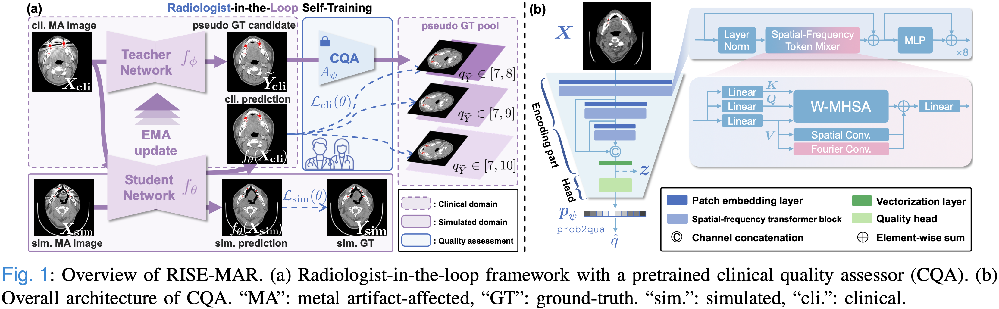

# RISE-MAR: Radiologist-in-the-Loop Self-Training for Generalizable CT Metal Artifact Reduction


This is the official repository for the paper "Radiologist-in-the-Loop Self-Training for Generalizable CT Metal Artifact Reduction". [[arxiv](https://arxiv.org/abs/2501.15610), [tmi](https://ieeexplore.ieee.org/document/10857416)]



## Highlights
- **RISE-MAR Framework**: A semi-supervised learning framework that ensures high-quality pseudo groundtruths for clinical CT metal artifact reduction (MAR).
- **Clinical Quality Assessor (CQA)**: A pretrained model that evaluates the quality of CT images potentially affected by metal artifacts


## Project Status
- [x] Preprint released
- [x] Core model implementation
- [x] Training code available
- [x] Pretrained CQA model weights [[download](https://github.com/Masaaki-75/rise-mar/releases/tag/v0.1)][[demo](https://github.com/Masaaki-75/rise-mar/blob/main/demo.ipynb)]


## Implementation Guide
To implement the full version of RISE-MAR, follow these steps:


### 1. Data Preparation
1. Download relevant CT datasets
2. Simulate metal artifact-affected data to construct paired data
3. Organize data using JSON metadata files

**Paired Data Example** (please see `./data/meta/example_paired_deepl.json`):
```jsonc
{
    "case_001": {
        "metal_img": "path/to/artifact_affected_image",
        "li_img": "path/to/LI_corrected_image",
        "gt_img": "path/to/artifact_free_ground_truth",
        "metal_mask": "path/to/metal_mask",
        "root_dir": "optional/path/prefix" 
    },
    // Additional cases...
}
```

**UnPaired Data Example** (please see `./data/meta/example_unpaired_deepl.json`):
```jsonc
{
    "ma": {  // Metal artifact-affected images
        "case_001": {
            "img": "path/to/artifact_affected_image",
            "quality": 5,  // For CQA model training, optional
            "root_dir": "optional/path/prefix"
        },
        // Additional cases...
    },
    "mf": {  // Metal artifact-free images
        "case_001": {
            "img": "path/to/artifact_free_image",
            "quality": 9,
            "root_dir": "optional/path/prefix"
        },
        // Additional cases...
    }
}
```

After preparation, browse `./configs/__init__.py` and update the paths for the metadata.


### 2. Baseline Model Training
We refer to "baseline models" as models that produce imperfect prediction for clinical MAR. These models can be obtained from: 
- Some conventional methods (e.g., LI, NMAR, ...)
- Insufficient training (e.g., early stop before model convergence)
- Models with limited domain transferability (e.g., can handle simulated metal artifacts very well but perform poor MAR on real data)
- ...

Turns out that they are still useful! In our work, they:
- serve as undertrained MAR models that provide CT images with low-to-moderate quality, <u>greatly enhancing the diversity of our clinical quality assessment dataset</u>.
- provide <u>better network initialization</u>, which often leads to a more stable training process for unsupervised or semisupervised methods.
- serve as the prior model, i.e., teacher network in our paper. A stronger prior model certainly perform better MAR, but with our RISE-MAR framework, we can still employ an imperfect one while expecting satisfactory MAR results ;) 
- ...

As an example of training script, please run:
```sh
bash scripts/train_supervised_mar.sh
```
Once the baseline models are prepared, configure related paths (`UNDETRAINED_WEIGHTS` and `PRETRAINED_*`) in `./configs/__init__.py`.


### 3. Clinical Quality Assessor (CQA) Training
Adjust the arguments in `scripts/train_cqa.sh` and run the training script:
```sh
bash scripts/train_cqa.sh
```

Update the path to the CQA model weights (`PRETRAINED_CQA_PATH`) in `./configs/__init__.py` after training.


### 4. MAR Model Training
Adjust the arguments in `scripts/train_risemar.sh` and run the training script:
```sh
bash scripts/train_risemar.sh
```


## Citation
If you find our work and code helpful, please kindly cite our paper :blue_heart:

```bibtex
@ARTICLE{ma2025risemar,
  author={Ma, Chenglong and Li, Zilong and Li, Yuanlin and Han, Jing and Zhang, Junping and Zhang, Yi and Liu, Jiannan and Shan, Hongming},
  journal={IEEE Transactions on Medical Imaging}, 
  title={Radiologist-in-the-Loop Self-Training for Generalizable {CT} Metal Artifact Reduction}, 
  year={2025},
  volume={},
  number={},
  pages={1-1},
  doi={10.1109/TMI.2025.3535906}
}
```
